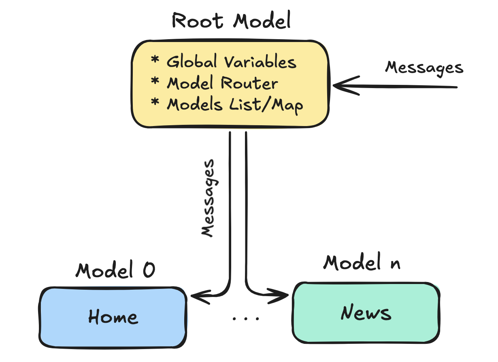

# Bubbletea TUI App - Example

I recently set out to build a terminal application featuring multiple screens, or "widgets," as I like to call them. The goal was to create an app that allows users to navigate through these widgets one at a time while displaying some basic information at the bottom of the screen. This information includes details like the current widget, the app name, its version, and the date/time.

Rather than building everything from scratch, I chose to use a framework called Bubbletea, written in Go. For styling, I paired Bubbletea with Lipgloss, which works seamlessly to define elegant terminal layouts.

## App Architecture Diagram

Bubbletea is a Go framework based on The Elm Architecture, a design pattern for building interactive programs such as web apps and games.

The core concepts of the Elm Architecture—also applicable to Bubbletea—are:

* Model: Represents the application's state.
* View: Defines how the state is visually represented.
* Update: Describes how the state changes in response to messages.
In this example, the app uses a Root Model to manage global variables accessible by sub-models, a router for navigating between models, and a list/map of models, where each model corresponds to a specific widget or screen.

When new messages are received, the Root Model propagates them to the appropriate sub-model based on the currently active model.



## Demo

```shell
go mod tidy
go run main.go
```


